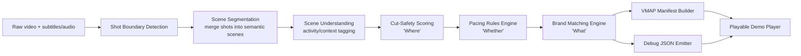

# Context-Aware Video Segmentation & Intelligent Ad Placement
## Build Guide + Agent Handoff Plan

This is a self-contained spec you can paste to any coding agent (Claude Code, Cursor, etc.) phase by phase, or all at once. Each phase has: goal, tasks, inputs/outputs, and an acceptance test the agent must pass before moving on. The design is built around the four hard constraints in the problem statement: no hardcoding, zero tolerance for negative-context violations, generalization to an unseen 9th brand, and a live-runnable demo.

---

## 1. Restating the problem as an engineering spec

Three questions, three subsystems, one pipeline:

| Question | Subsystem | Failure mode to avoid |
|---|---|---|
| **Where** can we cut? | Scene/shot boundary detector + "cut safety" scorer | Mid-sentence / mid-action cuts |
| **Whether** we should cut here | Ad-pacing rules engine | Too many breaks, breaks too close together, over ad-load% |
| **What** ad goes here | Brand-matching engine | Wrong brand for scene, or a *hard-blocked* brand slipping through |

The pipeline is strictly sequential and each stage's output is a versioned, inspectable JSON artifact — this is what makes the "debug JSON" deliverable trivial and what lets you swap any one component without touching the others.



---

## 2. Data contracts (define these FIRST — everything else is built against them)

Locking these schemas before writing pipeline code is the single highest-leverage thing you can do — it's what lets an agent build stages in parallel and what lets you swap the brand catalogue without touching code.

### 2.1 Scene object
```json
{
  "scene_id": "sc_014",
  "start_ts": 812.44,
  "end_ts": 897.10,
  "shot_ids": ["sh_041", "sh_042", "sh_043"],
  "activity_tags": [
    {"label": "funeral", "confidence": 0.91},
    {"label": "family_gathering", "confidence": 0.62}
  ],
  "dominant_activity": "funeral",
  "mood": "somber",
  "asr_text": "...transcript of dialogue in this scene...",
  "embedding": [/* 384 or 768-d vector, model-versioned */]
}
```

### 2.2 Break candidate object
```json
{
  "candidate_id": "brk_0007",
  "timestamp": 897.10,
  "scene_before": "sc_014",
  "scene_after": "sc_015",
  "cut_safety_score": 0.87,
  "cut_safety_reasons": {
    "sentence_boundary_aligned": true,
    "silence_gap_ms": 420,
    "shot_boundary_aligned": true,
    "action_continuity_penalty": 0.0
  },
  "pacing_eligible": true,
  "pacing_reasons": {
    "breaks_so_far_this_hour": 3,
    "min_gap_satisfied": true,
    "ad_load_budget_remaining_sec": 145
  },
  "final_decision": "BREAK_APPROVED"
}
```

### 2.3 Brand catalogue entry (this is what makes the "9th unseen brand" requirement trivial — brands are DATA, never code)
```json
{
  "brand_id": "brand_zestcola",
  "display_name": "ZestCola",
  "category": "beverage",
  "target_contexts": ["celebration", "youth_gathering", "sports_watching", "family_meal"],
  "negative_contexts": ["funeral", "hospital", "grief", "accident", "violence"],
  "creative_asset": "assets/ads/zestcola_15s.mp4",
  "duration_sec": 15,
  "tone": "energetic"
}
```
> Adding brand #9 = appending one JSON object to `brand_catalogue.json`. No code path may reference a brand name, ID, or category as a literal string anywhere in pipeline code. If you catch yourself typing `if brand == "zestcola"`, stop — that's an auto-disqualifier.

### 2.4 Manifest (IAB VMAP 1.0.1 compliant XML) + debug JSON
Debug JSON is the union of every scene, candidate, and match decision with full reasoning — this is your judge-facing transparency artifact and your own debugging tool.

---

## 3. Recommended stack (swap freely, but this combination is fast to build and defensible in Q&A)

| Stage | Tool | Why |
|---|---|---|
| Shot boundary detection | **PySceneDetect** (ContentDetector/AdaptiveDetector) or **TransNetV2** | Mature, fast, no training needed |
| ASR + word-level timestamps | **faster-whisper** (medium/large-v3) | Needed to detect mid-sentence cuts precisely |
| Scene activity/context tagging | Zero-shot **CLIP** frame embeddings + text-prompt similarity, or a VLM (LLaVA/Gemini/GPT-4V-class) called per keyframe | Zero-shot = generalizes to new activity labels without retraining |
| Scene/brand semantic matching | **sentence-transformers** (e.g. `all-mpnet-base-v2`) embedding cosine similarity between scene `activity_tags`/`asr_text` and brand `target_contexts`/`negative_contexts` | This embedding-based matching is *why* an unseen 9th brand works with zero code changes |
| Rules engine | Plain Python, config-driven (`pacing_rules.yaml`) | Auditable, no ML needed for business rules |
| Manifest | **lxml** + Jinja2 XML template validated against IAB VMAP 1.0.1 XSD | Standards compliance is explicitly graded |
| Video cutting / demo splicing | **ffmpeg** (concat demuxer or filter_complex) | Frame-accurate cuts |
| Demo player | Single-page **video.js** or plain HTML5 `<video>` + a manifest-driven JS scheduler | Must "actually cut to the ad and resume" live |

---

## 4. Phase-by-phase build plan

### Phase 0 — Repo & data scaffolding
**Tasks**
- Create repo structure (§6 below).
- Load sample videos + brand catalogue from the resources folder; validate catalogue against JSON schema.
- Write a `config/pacing_rules.yaml`: `max_breaks_per_hour`, `min_gap_seconds`, `target_ad_load_pct`, `first_break_not_before_sec`.
- Write JSON Schemas for every object in §2 and a validator script (`scripts/validate_schemas.py`).

**Acceptance test:** `pytest tests/test_schemas.py` passes on the sample catalogue; catalogue loader rejects a malformed entry.

---

### Phase 1 — Shot boundary + scene segmentation ("chunking")
**Tasks**
- Run PySceneDetect to get raw shot boundaries.
- Merge shots into semantic scenes using: (a) CLIP frame-embedding similarity across adjacent shots, (b) ASR topic continuity, (c) a max/min scene-duration heuristic. Merge shots whose combined embedding similarity exceeds a threshold and whose subtitle doesn't cross a hard topic change.
- Emit `scenes.json` per §2.1, with `asr_text` populated by faster-whisper (word-level timestamps kept for Phase 2).

**Acceptance test:** Manually spot-check 5 scene boundaries in each sample video against human judgment; scenes must not split a single continuous shot-reverse-shot dialogue in half more than X% of the time (define X, e.g. <10%, and log it).

---

### Phase 2 — Cut-safety scoring ("Where")
This is the most judge-scrutinized stage — "mid-dialogue cuts are heavily penalized."

**Tasks**
- For every scene boundary, compute a `cut_safety_score` from a weighted combination of *hard signals*, not vibes:
  - **Sentence-boundary alignment**: use Whisper's word-level timestamps — a candidate cut inside `[word.start, word.end]` of an unfinished sentence (no terminal punctuation / pause before next word > threshold) gets heavily penalized or hard-rejected.
  - **Silence/audio-energy gap**: measure RMS silence duration around the timestamp (via `librosa` or `pydub`); larger gap = safer cut.
  - **Shot-boundary alignment**: does the candidate fall exactly on a shot cut (from Phase 1) rather than mid-shot?
  - **Action continuity**: penalize cuts inside a scene tagged as continuous high-motion action (optical-flow magnitude spike) or mid a detected camera pan.
  - **Music/score phrasing** (stretch): avoid cutting mid-musical-phrase if a score is present.
- Combine into a single `cut_safety_score ∈ [0,1]` with logged sub-reasons (`cut_safety_reasons` in §2.2) — never emit a single opaque number; judges (and you, debugging) need the "why."
- Every scene boundary becomes a break *candidate*; ones below a safety floor are marked `cut_safety_score` low but still recorded (don't delete data — the debug JSON should show what was rejected and why).

**Acceptance test:** Build a small labeled set (even 20-30 manually judged boundaries: "safe"/"jarring") from the sample videos and report precision/recall of the safety classifier against human labels. This labeled mini-eval set is also your defensible answer when judges ask "how do you know this works."

---

### Phase 3 — Pacing / "whether a break is warranted" ("Whether")
**Tasks**
- Pure rules engine, config-driven, applied only to candidates that passed the Phase 2 safety floor:
  - Enforce `max_breaks_per_hour`.
  - Enforce `min_gap_seconds` between consecutive approved breaks.
  - Track cumulative ad seconds inserted vs. `target_ad_load_pct` of total runtime; stop approving once budget is exhausted.
  - Greedy or DP selection: among safety-passing candidates in a time window, prefer the highest `cut_safety_score` that also satisfies spacing constraints (this is a classic weighted interval scheduling problem — implement it as one, don't hand-roll ad hoc loops).
- Output the full candidate list with `pacing_eligible` + `final_decision` fields populated (approved / rejected-unsafe / rejected-pacing).

**Acceptance test:** Given a synthetic 2-hour timeline of candidates, verify programmatically that the output never violates `max_breaks_per_hour` or `min_gap_seconds`, and ad-load% stays under budget — write this as a property-based test (hypothesis library is ideal here).

---

### Phase 4 — Brand matching ("What") — the generalization-critical stage
**Tasks**
- For each approved break, take the scene(s) immediately before/after it and build a **scene context vector**: combine `activity_tags` (weighted by confidence, `dominant_activity` weighted highest) with an embedding of `asr_text`.
- For each brand in the catalogue (loaded as data, never hardcoded):
  1. **Hard block first, always, before any scoring.** If any scene `activity_tag` (dominant or not, above a small confidence floor) semantically matches any of the brand's `negative_contexts` (via embedding cosine similarity ≥ a strict threshold, not exact string match, so "cremation" still blocks a brand whose negative context is "funeral"), **eliminate that brand from consideration for this slot entirely.** This must be implemented as a hard filter step that runs before ranking — not as a large negative weight that a strong positive score could outweigh. Unit-test this explicitly with adversarial cases (e.g., a food brand vs. a scene tagged "wake"/"cremation"/"mourning" — synonyms the literal word "funeral" wouldn't catch).
  2. Among brands surviving the block, score `dominant_activity` + weighted `activity_tags` similarity against `target_contexts` via embedding cosine similarity; the dominant activity should dominate the score (e.g., 0.7 weight to dominant, 0.3 to secondary tags).
  3. Rank and pick top brand; store the full ranked list + scores in debug JSON (transparency again).
- **Generalization test is mandatory and automated**: add a 9th brand to the catalogue JSON only (zero code edits), rerun the pipeline end-to-end, and confirm it can be selected/blocked correctly purely from its `target_contexts`/`negative_contexts` data.

**Acceptance test:**
- Automated test: construct a scene tagged `funeral` (dominant) + a brand catalogue containing a food/beverage brand with `negative_contexts: ["funeral", ...]` → assert that brand never appears in the top-N output for that slot, under any score.
- Automated test: add brand #9 to the catalogue only, rerun, assert pipeline succeeds with no code diff (this can literally be a CI test that diffs `git status` after adding the brand and reruns the matcher).

---

### Phase 5 — VMAP manifest + debug JSON
**Tasks**
- Build a Jinja2 XML template implementing IAB VMAP 1.0.1 (`<vmap:VMAP>` root, one `<vmap:AdBreak>` per approved break, `timeOffset` in HH:MM:SS.mmm or `#N%` format, `breakType="linear"`, `<AdSource>` → VAST reference or inline, `AdTagURI` per brand creative).
- Validate every generated manifest against the public VMAP 1.0.1 XSD before considering the stage done — treat XSD validation as a build gate, not optional polish.
- Emit `debug.json` = the full pipeline trace (scenes → candidates → decisions → brand rankings) for every video processed.

**Acceptance test:** `xmllint --schema vmap_1.0.1.xsd manifest.xml` (or `lxml` equivalent) returns valid for every sample and the held-out set.

---

### Phase 6 — Playable demo
**Tasks**
- Single HTML page (or small React/video.js app): loads the source video + the generated manifest, plays normally, and at each approved `timeOffset` pauses the main video, plays the matched brand's creative asset, then resumes main playback at the exact prior position.
- No server-side dependency beyond static file serving — "must run live at presentation time" means zero flaky network calls to external APIs during the demo itself (do all ML inference offline/ahead of time; the demo only *consumes* the precomputed manifest + debug JSON).
- Add a small on-screen debug overlay (optional but strong for judging): show `cut_safety_score`, `dominant_activity`, and which brand was matched + why, at each break — this directly answers judges' "how do we know it's not hardcoded" skepticism live.

**Acceptance test:** Cold-start the demo (fresh browser tab, no cache) against a held-out video end-to-end without touching devtools.

---

### Phase 7 — Held-out evaluation harness (build this *before* you get the held-out set, not after)
**Tasks**
- `scripts/eval_holdout.py` that, given any new video + catalogue:
  1. Runs the full pipeline.
  2. Reports mid-sentence-cut count (must be 0 or explicitly justified/near-0).
  3. Reports negative-context-violation count (must be exactly 0 — this is a scored-zero criterion, so this script should be run as a final gate before every submission).
  4. Reports pacing-rule violations (must be 0).
  5. Confirms VMAP XSD validity.
  6. Confirms the pipeline never referenced a literal brand name/ID in code (simple grep-based check against the source tree, excluding config/data files).

**Acceptance test:** This script itself is your submission gate — do not submit if any check fails.

---

## 5. Anti-disqualifier checklist (map every rule to a concrete design decision)

| Disqualifier | Design decision that prevents it |
|---|---|
| Hard-coded timestamps/brands for sample videos | All brand data lives in `brand_catalogue.json`; all thresholds live in `pacing_rules.yaml`; CI check greps source for literal brand strings |
| Negative-context violation in held-out set | Hard filter (not soft penalty) implemented *before* ranking, tested adversarially with synonym scenes, gated by `eval_holdout.py` |
| Demo can't run live | All inference precomputed; demo is a static consumer of manifest+debug JSON; no external API calls at demo time |
| Real company names used | Catalogue ships only with synthetic names (ZestCola, etc.); add a lint rule that fails CI if any known trademark string appears in code/assets |

---

## 6. Repo structure

```
adtech-video-pipeline/
├── config/
│   ├── pacing_rules.yaml
│   └── model_versions.yaml
├── data/
│   ├── brand_catalogue.json
│   └── sample_videos/
├── schemas/
│   ├── scene.schema.json
│   ├── break_candidate.schema.json
│   └── brand.schema.json
├── pipeline/
│   ├── shot_detect.py
│   ├── scene_segment.py
│   ├── scene_understand.py      # activity/context tagging
│   ├── cut_safety.py             # "Where"
│   ├── pacing_engine.py          # "Whether"
│   ├── brand_matcher.py          # "What" (hard block + ranking)
│   ├── vmap_builder.py
│   └── run_pipeline.py           # single entrypoint: video in -> manifest+debug out
├── demo/
│   └── index.html                # video.js player consuming manifest.xml + debug.json
├── scripts/
│   ├── validate_schemas.py
│   ├── eval_holdout.py
│   └── check_no_hardcoding.sh
├── tests/
│   ├── test_cut_safety.py
│   ├── test_pacing_engine.py
│   ├── test_brand_matcher.py     # includes the adversarial negative-context tests
│   └── test_new_brand_generalization.py
└── README.md
```

---

## 7. Ready-to-paste agent task list (hand these to your coding agent one at a time, in order)

1. "Scaffold the repo per the structure in §6. Create empty JSON Schemas for `scene`, `break_candidate`, and `brand` per §2, plus `config/pacing_rules.yaml` with placeholder values. Write `scripts/validate_schemas.py`."
2. "Implement `pipeline/shot_detect.py` using PySceneDetect's AdaptiveDetector on a given video path, returning a list of shot boundary timestamps."
3. "Implement `pipeline/scene_segment.py`: merge shots into scenes using CLIP frame-embedding similarity + ASR topic continuity (faster-whisper). Output conforms to `scene.schema.json`."
4. "Implement `pipeline/scene_understand.py`: for each scene, produce `activity_tags` and `dominant_activity` via zero-shot CLIP-text similarity against an extensible, config-driven list of activity labels (not hardcoded per-video)."
5. "Implement `pipeline/cut_safety.py` per §Phase 2: sentence-boundary alignment from Whisper word timestamps, silence-gap measurement, shot-boundary alignment, action-continuity penalty. Return `cut_safety_score` + `cut_safety_reasons` per candidate."
6. "Implement `pipeline/pacing_engine.py` as a weighted-interval-scheduling selector honoring `max_breaks_per_hour`, `min_gap_seconds`, and `target_ad_load_pct` from `pacing_rules.yaml`. Add property-based tests with `hypothesis` proving no constraint is ever violated."
7. "Implement `pipeline/brand_matcher.py`: hard-filter brands whose `negative_contexts` embedding-match any scene `activity_tag` above threshold BEFORE ranking; then rank survivors by weighted similarity to `target_contexts`, dominant activity weighted highest. Load brands only from `data/brand_catalogue.json`. Add adversarial tests with synonym negative contexts."
8. "Write `tests/test_new_brand_generalization.py`: append a 9th synthetic brand to the catalogue JSON only, rerun the full matcher, assert correct behavior with zero source-code diff."
9. "Implement `pipeline/vmap_builder.py`: Jinja2-templated IAB VMAP 1.0.1 XML from approved break candidates + matched brands; validate against the public VMAP XSD as part of the function, raising on invalid output."
10. "Implement `pipeline/run_pipeline.py` as the single CLI entrypoint: video path in → `manifest.xml` + `debug.json` out."
11. "Build `demo/index.html`: video.js player that loads a source video + generated manifest/debug JSON, cuts to the matched brand creative at each approved break, and resumes main video playback. No server-side or external network calls at runtime."
12. "Write `scripts/eval_holdout.py` implementing every check in Phase 7, and `scripts/check_no_hardcoding.sh` to grep-fail on literal brand names in `pipeline/`."
13. "Run the full pipeline end-to-end on all sample videos, fix any XSD/schema validation failures, and produce a final `debug.json` + `manifest.xml` per video plus a working demo."

---

## 8. Where to spend your limited time if the deadline is tight

Priority order, because these map directly to scored/disqualifying criteria: **(1)** the negative-context hard-block + its adversarial tests — this alone is a zero-vs-nonzero criterion; **(2)** the cut-safety scorer's sentence-boundary logic — the other heavily-weighted "naive scoring" trap; **(3)** the 9th-brand generalization test, since it's explicitly checked; **(4)** a demo that survives a cold reload; **(5)** VMAP schema validity. Polish (nicer activity taxonomy, prettier demo UI, more brands) comes last.
